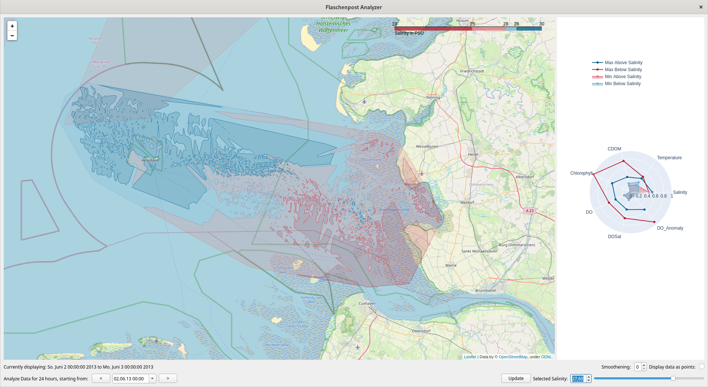

# Concept - VA visualisation App

The application was created in the lecture " Visual Analytics für raum-zeitliche Daten  " (Visual Analytics for spatial-temporal data) in the winter term 21 / 22. In the beginning
measuring points have been visualised on a map, representing the salinity on the plane. With various tools, users can then set the threshold so that a separation into fresh and salt water can be made.
In addition the right side shows different properties of water below and above the threshold.

## Technologies

- Python 3.*
- PySide
- Plotly
- Pandas
- Folium

## Packages

Please install the following packages. In brackets
I wrote down the used version:

- xarray (2022.10.0)
(installation guide [[https://docs.xarray.dev/en/stable/getting-started-guide/installing.html]] )
- folium (0.13.0)
- pyside2 (5.15)
- plotly (5.11)
- shapely (1.8.5)
- geojson (2.5)
- geojsoncontour (0.4)
- scipy (1.9.2.)

## Setup

To download the necessary data execute 
`database_builder.py`
This takes a lot of time and no breaks are possible.
Data is stored in `data_test.db`.

Then execute 
`Application.py`
to start the Application.

## Sources

This app was a group work, including @Jonitr0
